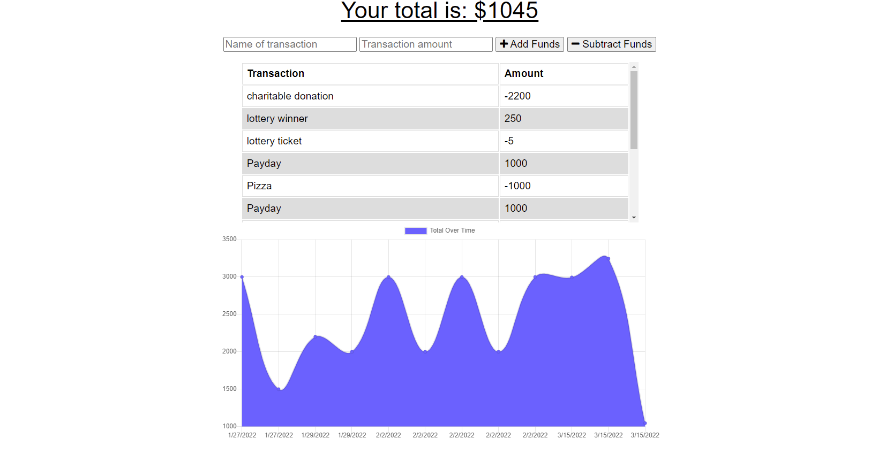

# Budget Tracker

## Deployed site
- Check out the deployed site here!

### https://budget-buddy-2022.herokuapp.com/
#

#

## Table of Contents

- [Description](#Description)
- [Installation](#Installation)
- [Contributing](#Contributing)
- [Questions](#Questions)

## Description:

The application allows a user to add expenses and deposits to their budget as well as take out costs with or without a connection. When entering transactions offline, they will populate the total as a user enters them in and will still be present when brought back online.

```
GIVEN a user is on Budget App without an internet connection
WHEN the user inputs a withdrawal or deposit
THEN that will be shown on the page, and added to their transaction history when their connection is back online.
The transaction history should be replayed in order.
The history should be kept in either IndexDB or browser cache.
If the server is up, the current transactions should still be sent to
the server without being add to the failure cache.
The initial list of cache_files should include all static assets.

```

## Installation:

- Download or clone the repo from GitHub
- Open terminal and type ```npm install``` and ```npm start``` to start the server on their localhost.

## Contributing:
- Worked using indexDB to allow offline functionality fo budget tracking. Used Service worker and web manifest to make the application a PWA. Utilized mongoDB and mongoose for model and data storage as well as api routes to interact with front end functionality.
- There a no plans for public contribution at this time.

## Questions

- If you have any questions, email me at phalenhazel@gmail.com
- Checkout my GitHub profile [here](https://github.com/PhalenH)
